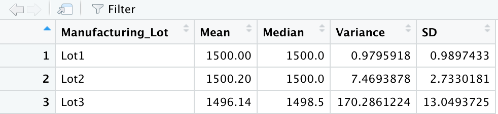
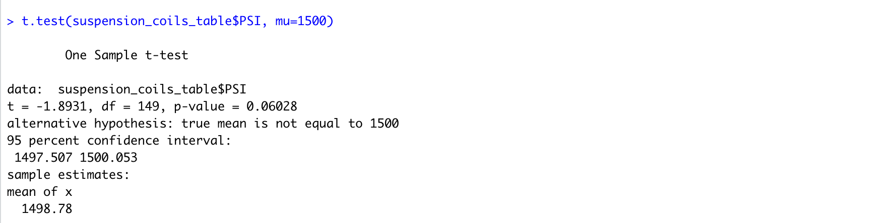
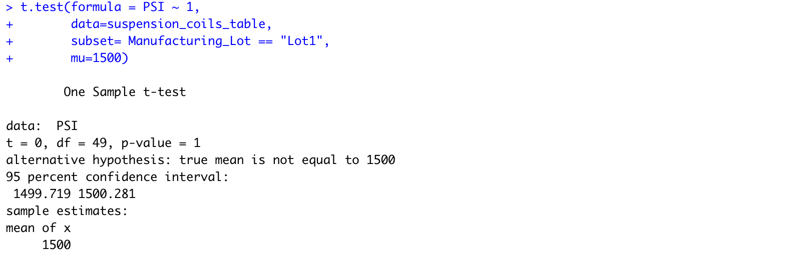
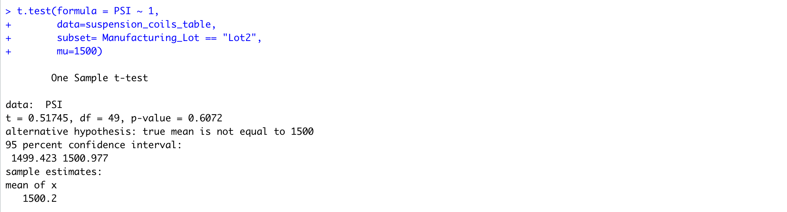

# Overview

In this module, statistical analyses are performed using R on given data files, and their summary results are presented [here](MechaCar_mpg.csv).

# Deliverables

## Linear Regression to Predict MPG

In this deliverable, MPG of cars are predicted based upon several independent variables. There are a total of 50 data points and the data file is available here. The linear regression equation is found as follows:

```
mpg = -104 + 6.27*length + 0.001*weight + 0.069*angle + 3.55*clearance -3.41*AWD

```

The summary statistics are given in the table as below.

| Statistic | Value | Description |
| --------- | ----- | ----------- |
| Residual standard error | 8.774 | 44 degrees of freedom |
| Multiple R-squared | 0.7149 | |
| Adjusted R-squared | 0.6825 | |
| F-statistic | 22.07 | 5 and 44 DF |
| **p-value** | **5.35e-11** | |

From the table, we see that the *p-value* of the regression is lesser than 0.05. This shows that the NULL hypothesis is **rejected**, and the alternative hypothesis is true. Meaning, the slope of the regression is nonzero, and the **mpg of the car is influenced by at least one of the independent variables considered in the analysis.**

To understand which independent variables are important predictors, both the *coefficient* and the *p-value* of the coefficient are considered. The coefficient should be large and the p-value should be small for the independent variable to be important for the model. The table below shows important variables.

| Variable | Coefficient | Standard error | t-statistic | p-value | Is Important | 
| -------- | ----------- | -------------- | ----------- | ------- | ------------ |
| Intercept | -104 | 1.585e+01 | -6.559 | 5.08e-08 | **Yes** |
| vehicle_length | 6.267 |  6.553e-01 | 9.563 | 2.60e-12 | **Yes** |
| vehicle_weight | 1.245e-03 | 6.890e-04 | 1.807 | 0.0776 | **No** |  
| spoiler_angle | 6.877e-02 | 6.653e-02 | 1.034 | 0.3069 | **No** |   
| ground_clearance | 3.546 | 5.412e-01 | 6.551 | 5.21e-08 | **Yes** |
| AWD | -3.411 | 2.535 | -1.346 | 0.1852 | **No** |


From the table above, we see the following variables are good predictors of the **mpg** of the vehicle. In both cases, the coefficient is high, the standard error is low and thus, the p-value is very low.
* **Vehicle Length**
* **Ground Clearance**

Conversely, the following three variables are **not** good predictors of **mpg** and should be dropped from the model.
* **Vehicle Weight**: The coefficient is low. The standard error is low as well, and the t-statistic is 1.807. The p-value is 0.07 - it's just slightly higher than the standard 0.05. This fact, plus the very low coefficient value means including this variable in the regression model is not valuable.
* **Spoiler Angle**: The coefficient is low, and the standard error is comparatively high. The p-value is quite high at 0.3. This variable should be dropped from the model.
* **AWD**: The coefficient is high, but the standard error is high as well, and the p-value is at 0.19, which is much higher than 0.05. This variable is thus not an accurate predictor of **mpg** and should be dropped from the model.


## Summary Statistics on Suspension Coils

In this dataset as seen [here](Suspension_Coil.csv), data is given for the vehicle *PSI* manufactured in three different lots. The objective is to keep the PSI values as close as possible to the ideal target value of **1500**.

First, the summary statistics of of all data can be seen in the screenshot below.


*Image 1: Summary Statistics for All Data*

As seen above, the mean of 1498.78 tracks very closely to the ideal value of 1500. The variable of 62.29 is below the target maximum variance of 100. Overall, all lots seem to be performing as per the speck. The next question is to determine if there are qualitative differences in the manufacturing processes of the three lots.

The screenshot below shows the summary statistics of the individual lot.



*Image 2: Summary Statistics for Each Lot*

As seeen above, a drastically different picture emerges.

* Lot 1 is nearly spotless with the best performance. Its mean is almost exactly 1500 and its variance is almost negligible and < 1.
* Lot 2 is also highly performant. Its mean of 1500.2 just veers higher than the target value of 1500, and its variance of 7.47 is way below the target variance of 100.
* Lot 3 is non-performant and needs to be fixed. Its mean is 1496.14, which seems significantly lower than the target mean of 1500, and its variance of 170.29 is much higher than the target variance of 100. The manufacturing data for lot three shows that it **does not meet the design specifications**. 

## T-Tests on Suspension Coils

From the Suspension coils dataset as seen [here](Suspension_Coil.csv), we wish to investigate if:
* The population mean is significantly different from the target mean of 1500
* The mean of each of the lots is significantly different from the target mean of 1500.

### Population Mean PSI

The screenshot below shows the result of the t-test of the entire population. The population mean of 1496.78 appears different from 1500, but the p-value of 0.06 is greater than 0.05, so we cannot rule out the NULL hypothesis. The probability of **false negative is 94%**, which is quite high, but in statistics, 95% is usually required (corresponding to the p-value of 0.or or lower) to reject the NULL hypothesis.



*Image 3: t-test for the Whole Dataset*

### Mean PSI for Each Lot

The three images below show the results of the t-tests for each lot. We can see that the means are statistically identical to 1500 for lots 1 and 2, but the mean is proven to be statistically different than 1500 for lot 3 since the p-value is less than 0.05 - it is calculated as 0.042. Thus, we conclude that the PSI mean is different than the target PSI value of 1500 **only for lot 3**.

| Lot 1 | Lot 2 | Lot 3 |
| ----- | ----- | ----- |
||||


